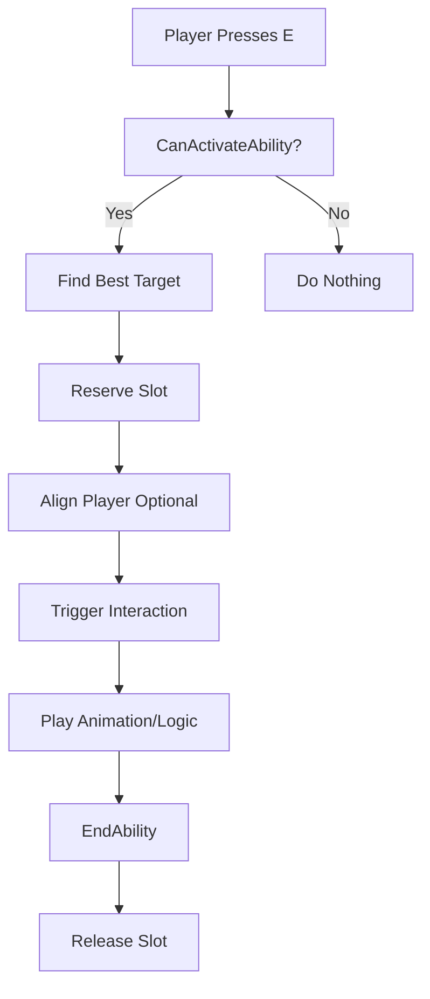

# Smart Object Interaction System - Beginner's Guide

## Table of Contents
1. [What is the Interaction System?](#what-is-the-interaction-system)
2. [Quick Start Guide](#quick-start-guide)
3. [Understanding DAIInteractAbility](#understanding-daiinteractability)
4. [Setting Up Your First Interactive Object](#setting-up-your-first-interactive-object)
5. [Creating UI Prompts](#creating-ui-prompts)
6. [Configuration Reference](#configuration-reference)
7. [Common Use Cases](#common-use-cases)
8. [Troubleshooting](#troubleshooting)
9. [Advanced Topics](#advanced-topics)

---

## What is the Interaction System?

The **Smart Object Interaction System** provides a "Press E to Interact" mechanic for your game. It intelligently selects what the player wants to interact with based on:
- **What you're looking at** (center of screen)
- **How close you are** to the object
- **How important/visible** the object is

Think of it like this: When you walk up to a door and look at it, the game knows you want to interact with *that door* and not the chair behind you, even if the chair is closer.

### Key Features
- ✅ **Smart Target Selection** - Automatically picks the "right" object to interact with
- ✅ **Camera-Aware** - Prioritizes objects in the center of your view
- ✅ **Distance-Based** - Closer objects score higher
- ✅ **Performance-Friendly** - Skips invisible/LOD objects
- ✅ **Flexible Filtering** - Use tags to specify what can be interacted with
- ✅ **Animation Support** - Align player to interaction points

---

## Quick Start Guide

### For Beginners: 5-Minute Setup

**Step 1: Add Smart Object Component to Your Actor**
```cpp
// In your door/lever/chest Blueprint or C++ class
UPROPERTY(EditAnywhere, BlueprintReadWrite)
UDAISmartObjectComponent* SmartObjectComponent;
```

**Step 2: Configure Interaction Slots**
- Add the `DAISmartObjectComponent` to your actor
- In the component details, add a slot (e.g., "InteractionPoint")
- Tag it with `DAI.SmartObject.Function.Door` (or appropriate tag)
- Position the slot where the player should stand

**Step 3: Grant Interaction Ability to Player**
```cpp
// In your player character's BeginPlay or ability system setup
AbilitySystemComponent->GiveAbility(
    FGameplayAbilitySpec(UDAIInteractAbility::StaticClass(), 1)
);
```

**Step 4: Bind Input**
```cpp
// In your PlayerController or Character
EnhancedInputComponent->BindAction(InteractAction, ETriggerEvent::Triggered, this, &AMyCharacter::OnInteractPressed);

void AMyCharacter::OnInteractPressed()
{
    // Try to activate the interaction ability
    AbilitySystemComponent->TryActivateAbilityByClass(UDAIInteractAbility::StaticClass());
}
```

**That's it!** Your player can now interact with smart objects.

---

## Understanding DAIInteractAbility

### What Is It?
`UDAIInteractAbility` is a **Gameplay Ability** that handles player interactions with smart objects. It's part of the Gameplay Ability System (GAS).

### How Does It Work?

#### 1. **Finding Targets** (Automatic)
When you try to activate the ability, it:
1. Looks for all Smart Object slots within `ActivationRange` (default: 400 units)
2. Filters by `DesiredSlotTags` if specified
3. Scores each candidate based on:
   - How centered it is in your camera view
   - How close it is to you
   - How visible/important it is (Performance Manager)
4. Picks the highest-scoring target

#### 2. **Scoring Formula** (Don't worry, you don't need to calculate this!)
```
Score = (CenterWeight × CenterScore) + (SignificanceWeight × Significance) + (DistanceWeight × DistanceFactor)
```

**What this means in plain English:**
- Objects in the center of your screen score higher (controlled by `CenterWeight`)
- Objects that are visible/important score higher (controlled by `SignificanceWeight`)
- Closer objects score higher (controlled by `DistanceWeight`)

**Default weights:**
- `CenterWeight = 2.0` - Looking at something is twice as important as distance
- `SignificanceWeight = 1.0` - Visibility matters equally to distance
- `DistanceWeight = 0.5` - Distance matters half as much as center-of-screen

#### 3. **Activation Flow**


---

## Setting Up Your First Interactive Object

### Example: A Door That Opens

#### Blueprint Setup

**1. Create Door Actor Blueprint**
- Create new Blueprint based on `Actor`
- Add `StaticMeshComponent` for the door visual
- Add `DAISmartObjectComponent`

**2. Configure Smart Object Component**
- **Slots**: Add one slot named "DoorHandle"
- **Slot Tags**: `DAI.SmartObject.Function.Door`
- **Slot Transform**: Position it in front of the door (where player stands)
- **Slot Rotation**: Face the player toward the door

**3. Add Door Logic**
```cpp
// In your Door Blueprint or C++ class
UFUNCTION(BlueprintCallable)
void OnInteract(AActor* Interactor)
{
    // Called when player interacts
    if (bIsOpen)
    {
        CloseDoor();
    }
    else
    {
        OpenDoor();
    }
}
```

**4. Connect to Smart Object System**

You have two options:

**Option A: Use Gameplay Events (Recommended)**
- Set up a `GameplayEvent` tag: `Event.Interaction.Door`
- When ability activates, it sends this event
- Your door listens for the event and responds

**Option B: Direct Function Call**
- Override `OnSlotReserved` in your Smart Object Component
- Call your door's logic directly

#### C++ Setup

```cpp
// YourDoor.h
UCLASS()
class AYourDoor : public AActor
{
    GENERATED_BODY()

public:
    AYourDoor();

    UPROPERTY(EditAnywhere, BlueprintReadWrite)
    UDAISmartObjectComponent* SmartObjectComponent;

    UPROPERTY(EditAnywhere, BlueprintReadWrite)
    UStaticMeshComponent* DoorMesh;

    UPROPERTY(EditAnywhere, BlueprintReadWrite)
    bool bIsOpen = false;

    UFUNCTION(BlueprintCallable)
    void ToggleDoor();
};

// YourDoor.cpp
AYourDoor::AYourDoor()
{
    DoorMesh = CreateDefaultSubobject<UStaticMeshComponent>(TEXT("DoorMesh"));
    RootComponent = DoorMesh;

    SmartObjectComponent = CreateDefaultSubobject<UDAISmartObjectComponent>(TEXT("SmartObject"));
    
    // Configure slot in constructor or Blueprint
}

void AYourDoor::ToggleDoor()
{
    bIsOpen = !bIsOpen;
    
    if (bIsOpen)
    {
        // Play door open animation/timeline
        DoorMesh->SetRelativeRotation(FRotator(0, 90, 0));
    }
    else
    {
        // Play door close animation
        DoorMesh->SetRelativeRotation(FRotator(0, 0, 0));
    }
}
```

---

## Creating UI Prompts

### "Press E to Interact" Widget

You need to show players when they can interact with something. Use `QueryInteractionTarget()` to check without activating.

#### Blueprint Widget Example

**Widget Blueprint (WBP_InteractionPrompt):**

1. Add a **Text Block** for the prompt (e.g., "Press E to Open Door")
2. Add **Tick Event** to update visibility

```cpp
// In your widget's Event Tick
void UInteractionWidget::NativeTick(const FGeometry& MyGeometry, float InDeltaTime)
{
    Super::NativeTick(MyGeometry, InDeltaTime);

    // Get player's interaction ability
    UDAIInteractAbility* InteractAbility = GetPlayerInteractAbility();
    if (!InteractAbility)
    {
        SetVisibility(ESlateVisibility::Hidden);
        return;
    }

    // Check if we have a valid target
    FTransform SlotTransform;
    AActor* TargetActor;
    FName SlotName;
    
    if (InteractAbility->QueryInteractionTarget(SlotTransform, TargetActor, SlotName))
    {
        // We have a target - show prompt
        SetVisibility(ESlateVisibility::Visible);
        
        // Optionally, customize the text based on the target
        FString InteractionText = GetInteractionText(TargetActor);
        PromptText->SetText(FText::FromString(InteractionText));
    }
    else
    {
        // No target - hide prompt
        SetVisibility(ESlateVisibility::Hidden);
    }
}

FString UInteractionWidget::GetInteractionText(AActor* Target)
{
    // Customize based on target type
    if (Target->IsA(ADoor::StaticClass()))
    {
        return "Press E to Open Door";
    }
    else if (Target->IsA(AChest::StaticClass()))
    {
        return "Press E to Open Chest";
    }
    else if (Target->IsA(ALever::StaticClass()))
    {
        return "Press E to Pull Lever";
    }
    
    return "Press E to Interact";
}
```

#### Optimized Version (Don't Check Every Frame)

```cpp
// Instead of Tick, use a timer
void UInteractionWidget::NativeConstruct()
{
    Super::NativeConstruct();
    
    // Check every 0.1 seconds instead of every frame
    GetWorld()->GetTimerManager().SetTimer(
        UpdateTimerHandle,
        this,
        &UInteractionWidget::UpdatePrompt,
        0.1f,
        true
    );
}

void UInteractionWidget::UpdatePrompt()
{
    // Same logic as above, but called less frequently
    // ...
}
```

---

## Configuration Reference

### DAIInteractAbility Properties

| Property | Type | Default | Description |
|----------|------|---------|-------------|
| **ActivationRange** | float | 400.0 | How far the player can interact (units) |
| **DesiredSlotTags** | FGameplayTagContainer | Empty | Filter which slots to consider (empty = all) |
| **MaxCenterAngleDegrees** | float | 20.0 | Max angle from camera center (degrees) |
| **CenterWeight** | float | 2.0 | Importance of being centered in view |
| **SignificanceWeight** | float | 1.0 | Importance of object visibility/LOD |
| **DistanceWeight** | float | 0.5 | Importance of proximity |
| **bRequireFullActor** | bool | true | Skip LOD proxies (prevents invisible interactions) |
| **bAlignRotationToSlot** | bool | true | Rotate player to face slot on activate |
| **bTeleportToSlot** | bool | true | Move player to slot position on activate |

### When to Adjust These Values

#### ActivationRange
- **300-400**: Close interactions (levers, buttons, doors)
- **500-800**: Medium range (large objects, NPCs)
- **1000+**: Long range (signposts, landmarks)

#### MaxCenterAngleDegrees
- **10-15°**: Precise targeting (small objects, buttons)
- **20-30°**: Normal interactions (doors, chests)
- **40-60°**: Forgiving targeting (large objects, NPCs)

#### Weights
- **Increase CenterWeight** if players complain about interacting with things behind them
- **Increase DistanceWeight** if you want closer objects prioritized more
- **Increase SignificanceWeight** if important objects aren't being selected

#### Alignment Options
- **Both false**: Player stays where they are (good for simple prompts)
- **Rotation only**: Player turns to face object (good for dialogue)
- **Both true**: Player moves to precise position (good for synchronized animations like sitting)

---

## Common Use Cases

### 1. Simple Door Interaction

**Setup:**
```cpp
// Door smart object settings
ActivationRange = 300.0f
DesiredSlotTags = "DAI.SmartObject.Function.Door"
bAlignRotationToSlot = true
bTeleportToSlot = false  // Don't need to move player
```

### 2. NPC Dialogue

**Setup:**
```cpp
// NPC smart object settings
ActivationRange = 500.0f
DesiredSlotTags = "DAI.SmartObject.Function.Dialogue"
MaxCenterAngleDegrees = 30.0f  // More forgiving
bAlignRotationToSlot = true
bTeleportToSlot = false
```

### 3. Precise Animation (Sitting on Bench)

**Setup:**
```cpp
// Bench smart object settings
ActivationRange = 400.0f
DesiredSlotTags = "DAI.SmartObject.Function.Sit"
bAlignRotationToSlot = true
bTeleportToSlot = true  // Need exact position for sit animation
```

### 4. Pickups/Loot

**Setup:**
```cpp
// Pickup smart object settings
ActivationRange = 300.0f
DesiredSlotTags = "DAI.SmartObject.Function.Pickup"
bAlignRotationToSlot = false  // Don't rotate
bTeleportToSlot = false        // Don't move
CenterWeight = 3.0f            // Heavily favor what you're looking at
```

### 5. Multi-Functional Object (Door with Lock)

**Smart Object Configuration:**
```cpp
// Create multiple slots on same object
Slot 1: "DoorHandle" - Tag: "DAI.SmartObject.Function.Door"
Slot 2: "Keyhole"    - Tag: "DAI.SmartObject.Function.Unlock"

// Player ability filters by context
if (Door->IsLocked())
{
    // Show "Press E to Unlock" (targets Keyhole slot)
    InteractAbility->DesiredSlotTags = FGameplayTag("DAI.SmartObject.Function.Unlock");
}
else
{
    // Show "Press E to Open" (targets DoorHandle slot)
    InteractAbility->DesiredSlotTags = FGameplayTag("DAI.SmartObject.Function.Door");
}
```

---

## Troubleshooting

### Problem: "Nothing happens when I press E"

**Checklist:**
1. ✅ Does your player have the `DAIInteractAbility` granted?
   ```cpp
   // Check in Blueprint or C++
   AbilitySystemComponent->GetActivatableAbilities()
   ```

2. ✅ Is the ability bound to input?
   ```cpp
   // Verify input binding exists
   ```

3. ✅ Is the smart object within `ActivationRange`?
   ```cpp
   // Try increasing ActivationRange temporarily to 1000
   ```

4. ✅ Do the slot tags match `DesiredSlotTags`?
   ```cpp
   // Try setting DesiredSlotTags to empty (interacts with everything)
   ```

5. ✅ Is the slot available (not already in use)?

### Problem: "Wrong object is being selected"

**Solutions:**

**If selecting objects behind you:**
- Increase `CenterWeight` to 3.0 or 4.0
- Decrease `MaxCenterAngleDegrees` to 15.0

**If selecting distant objects over close ones:**
- Increase `DistanceWeight` to 1.0 or higher
- Decrease `ActivationRange`

**If not selecting what you're looking at:**
- Decrease `CenterWeight` slightly
- Increase `MaxCenterAngleDegrees` to 25-30

### Problem: "Interacting with invisible LOD objects"

**Solution:**
```cpp
// Make sure this is true
bRequireFullActor = true
```

This prevents interactions with HISM instances, particle systems, and other LOD proxies.

### Problem: "UI prompt flickers on/off"

**Causes:**
- Checking every frame with equal-scoring objects nearby
- Player at exact boundary of `ActivationRange`

**Solutions:**
```cpp
// 1. Add hysteresis to range checking
float ActivationRangeWithHysteresis = bHadTargetLastFrame ? 450.0f : 400.0f;

// 2. Check less frequently (every 0.1s instead of every frame)
GetWorld()->GetTimerManager().SetTimer(..., 0.1f, true);

// 3. Add minimum score threshold
if (BestScore < 1.0f) return false; // Don't show prompt for low-scoring targets
```

### Problem: "Player doesn't align to slot correctly"

**Check:**
1. ✅ Is slot transform positioned correctly in editor?
2. ✅ Is `bAlignRotationToSlot` or `bTeleportToSlot` enabled?
3. ✅ Does the slot have the correct rotation (forward vector)?

**Debug Visualization:**
```cpp
// In editor, enable debug drawing
SmartObjectComponent->bDebugDraw = true;
```

---

## Advanced Topics

### Custom Scoring Logic

If the default scoring doesn't fit your needs, you can create a derived class:

```cpp
UCLASS()
class UMyCustomInteractAbility : public UDAIInteractAbility
{
    GENERATED_BODY()

protected:
    // Override FindCandidate to implement custom scoring
    virtual bool FindCandidate(const FGameplayAbilityActorInfo* ActorInfo, 
                              FTransform& OutSlotTransform, 
                              AActor*& OutTargetActor, 
                              FName& OutSlotName) const override;
};
```

### Multiple Interaction Types

Grant different abilities for different contexts:

```cpp
// Grant multiple interaction abilities with different configs
FGameplayAbilitySpec DoorInteract(UDoorInteractAbility::StaticClass(), 1);
FGameplayAbilitySpec NPCInteract(UNPCInteractAbility::StaticClass(), 1);
FGameplayAbilitySpec PickupInteract(UPickupInteractAbility::StaticClass(), 1);

AbilitySystemComponent->GiveAbility(DoorInteract);
AbilitySystemComponent->GiveAbility(NPCInteract);
AbilitySystemComponent->GiveAbility(PickupInteract);

// Activate the right one based on context
if (bLookingAtDoor)
    AbilitySystemComponent->TryActivateAbilityByClass(UDoorInteractAbility::StaticClass());
else if (bLookingAtNPC)
    AbilitySystemComponent->TryActivateAbilityByClass(UNPCInteractAbility::StaticClass());
```

### Conditional Interactions

Make interactions available only under certain conditions:

```cpp
// Override CanActivateAbility to add custom logic
bool UMyInteractAbility::CanActivateAbility(
    const FGameplayAbilitySpecHandle Handle,
    const FGameplayAbilityActorInfo* ActorInfo,
    const FGameplayTagContainer* SourceTags,
    const FGameplayTagContainer* TargetTags,
    FGameplayTagContainer* OptionalRelevantTags) const
{
    // Call parent first
    if (!Super::CanActivateAbility(Handle, ActorInfo, SourceTags, TargetTags, OptionalRelevantTags))
    {
        return false;
    }

    // Add custom conditions
    AMyCharacter* Character = Cast<AMyCharacter>(ActorInfo->AvatarActor.Get());
    if (!Character)
        return false;

    // Example: Need key to interact with locked doors
    if (CachedTargetActor.IsValid())
    {
        ALockedDoor* Door = Cast<ALockedDoor>(CachedTargetActor.Get());
        if (Door && Door->IsLocked() && !Character->HasKey())
        {
            return false; // Can't activate without key
        }
    }

    return true;
}
```

### Animation Integration

Synchronize animations with interactions:

```cpp
void UMyInteractAbility::ActivateAbility(...)
{
    Super::ActivateAbility(...);

    // After alignment, play animation
    if (AActor* Avatar = ActorInfo->AvatarActor.Get())
    {
        if (UAnimInstance* AnimInstance = GetAnimInstance(Avatar))
        {
            // Play interaction animation montage
            AnimInstance->Montage_Play(InteractionMontage);
            
            // Wait for montage to finish
            FOnMontageEnded MontageEndedDelegate;
            MontageEndedDelegate.BindUObject(this, &UMyInteractAbility::OnMontageEnded);
            AnimInstance->Montage_SetEndDelegate(MontageEndedDelegate);
        }
    }
}

void UMyInteractAbility::OnMontageEnded(UAnimMontage* Montage, bool bInterrupted)
{
    // Animation finished, complete the interaction
    EndAbility(...);
}
```

### Network Replication

For multiplayer games:

```cpp
// In your ability class
UMyInteractAbility::UMyInteractAbility()
{
    // Configure replication policy
    NetExecutionPolicy = EGameplayAbilityNetExecutionPolicy::ServerInitiated;
    InstancingPolicy = EGameplayAbilityInstancingPolicy::InstancedPerExecution;
}

// Override ActivateAbility to sync with server
void UMyInteractAbility::ActivateAbility(...)
{
    if (!CommitAbility(Handle, ActorInfo, ActivationInfo))
    {
        EndAbility(...);
        return;
    }

    // Server-side logic here
    if (ActorInfo->IsNetAuthority())
    {
        // Reserve slot, perform interaction
    }
}
```

---

## Best Practices

### 1. **Use Appropriate Tags**
Organize your slot tags hierarchically:
```
DAI.SmartObject.Function.Door
DAI.SmartObject.Function.Door.Wooden
DAI.SmartObject.Function.Door.Metal
DAI.SmartObject.Function.Dialogue
DAI.SmartObject.Function.Pickup
DAI.SmartObject.Function.Sit
```

### 2. **Visual Feedback**
Always provide feedback when interaction is available:
- ✅ UI prompt ("Press E")
- ✅ Outline/highlight on object
- ✅ Change cursor icon
- ✅ Play sound/haptic feedback

### 3. **Accessibility**
- Allow key rebinding
- Support controller, keyboard, and touch
- Provide audio cues for blind players
- Use clear, simple language in prompts

### 4. **Performance**
- Don't check for interactions every frame (use 0.1s timer)
- Limit `ActivationRange` to reasonable distances
- Use `bRequireFullActor = true` to skip LOD proxies
- Profile your interaction queries

### 5. **Testing**
Test interactions from:
- Different angles (front, side, back)
- Different distances (min and max range)
- With multiple nearby objects
- With moving objects
- In multiplayer scenarios

---

## Quick Reference: Common Tags

### Slot Function Tags
```
DAI.SmartObject.Function.Door          // Doors
DAI.SmartObject.Function.Dialogue      // NPCs/Conversation
DAI.SmartObject.Function.Pickup        // Items/Loot
DAI.SmartObject.Function.Sit           // Benches/Chairs
DAI.SmartObject.Function.Unlock        // Locks/Keys
DAI.SmartObject.Function.Activate      // Buttons/Levers
DAI.SmartObject.Function.Container     // Chests/Storage
DAI.SmartObject.Function.Crafting      // Workbenches
DAI.SmartObject.Function.Merchant      // Shops
```

### Slot Utility Tags
```
DAI.SmartObject.Slot.Utility           // General utility slot
DAI.SmartObject.Slot.Interaction       // Interaction point
DAI.SmartObject.Slot.Animation         // Animation sync point
```

---

## Example: Complete Door Setup

Here's everything you need for a working interactive door:

### 1. Door Actor (C++)

```cpp
// InteractiveDoor.h
#pragma once
#include "GameFramework/Actor.h"
#include "DAISmartObjectComponent.h"
#include "InteractiveDoor.generated.h"

UCLASS()
class AInteractiveDoor : public AActor
{
    GENERATED_BODY()

public:
    AInteractiveDoor();

    UPROPERTY(EditAnywhere, BlueprintReadWrite)
    UStaticMeshComponent* DoorMesh;

    UPROPERTY(EditAnywhere, BlueprintReadWrite)
    UDAISmartObjectComponent* SmartObject;

    UPROPERTY(EditAnywhere, BlueprintReadWrite)
    bool bIsOpen = false;

    UPROPERTY(EditAnywhere, BlueprintReadWrite)
    float OpenAngle = 90.0f;

    UFUNCTION(BlueprintCallable)
    void ToggleDoor();

protected:
    virtual void BeginPlay() override;
};

// InteractiveDoor.cpp
#include "InteractiveDoor.h"

AInteractiveDoor::AInteractiveDoor()
{
    DoorMesh = CreateDefaultSubobject<UStaticMeshComponent>(TEXT("DoorMesh"));
    RootComponent = DoorMesh;

    SmartObject = CreateDefaultSubobject<UDAISmartObjectComponent>(TEXT("SmartObject"));
}

void AInteractiveDoor::BeginPlay()
{
    Super::BeginPlay();
    
    // Listen for slot reserved events
    SmartObject->OnSlotReserved.AddDynamic(this, &AInteractiveDoor::ToggleDoor);
}

void AInteractiveDoor::ToggleDoor()
{
    bIsOpen = !bIsOpen;
    
    FRotator NewRotation = FRotator(0, bIsOpen ? OpenAngle : 0, 0);
    DoorMesh->SetRelativeRotation(NewRotation);
}
```

### 2. Configure in Editor
- Add slot named "Handle"
- Tag: `DAI.SmartObject.Function.Door`
- Position slot in front of door

### 3. Player Setup
```cpp
// In PlayerCharacter.cpp
void AMyCharacter::BeginPlay()
{
    Super::BeginPlay();
    
    // Grant interaction ability
    if (AbilitySystemComponent)
    {
        FGameplayAbilitySpec Spec(UDAIInteractAbility::StaticClass(), 1);
        AbilitySystemComponent->GiveAbility(Spec);
    }
}

void AMyCharacter::SetupPlayerInputComponent(UInputComponent* PlayerInputComponent)
{
    Super::SetupPlayerInputComponent(PlayerInputComponent);
    
    // Bind interaction input
    PlayerInputComponent->BindAction("Interact", IE_Pressed, this, &AMyCharacter::OnInteract);
}

void AMyCharacter::OnInteract()
{
    if (AbilitySystemComponent)
    {
        AbilitySystemComponent->TryActivateAbilityByClass(UDAIInteractAbility::StaticClass());
    }
}
```

### 4. UI Widget
```cpp
// WBP_InteractionPrompt.cpp
void UInteractionPrompt::NativeTick(const FGeometry& MyGeometry, float InDeltaTime)
{
    Super::NativeTick(MyGeometry, InDeltaTime);
    
    UDAIInteractAbility* Ability = GetPlayerInteractAbility();
    if (!Ability) return;
    
    FTransform SlotTransform;
    AActor* Target;
    FName SlotName;
    
    if (Ability->QueryInteractionTarget(SlotTransform, Target, SlotName))
    {
        PromptText->SetVisibility(ESlateVisibility::Visible);
        PromptText->SetText(FText::FromString("Press E to Open Door"));
    }
    else
    {
        PromptText->SetVisibility(ESlateVisibility::Hidden);
    }
}
```

**Done!** You now have a fully functional interactive door.

---

## Additional Resources

- **Main Documentation**: See `DAI_SmartObject.md` for complete API reference
- **Gameplay Tags**: See `DAI_GameplayTags.cpp` for standard interaction tags
- **Example Project**: Check `DAIExampleProject` for working samples
- **Source Code**: `DAI_SmartObject/Source/DAI_SmartObject/Public/DAIInteractAbility.h`

---

**Last Updated**: November 22, 2025  
**Plugin Version**: DAI_SmartObject 1.0  
**Engine Version**: Unreal Engine 5.5
